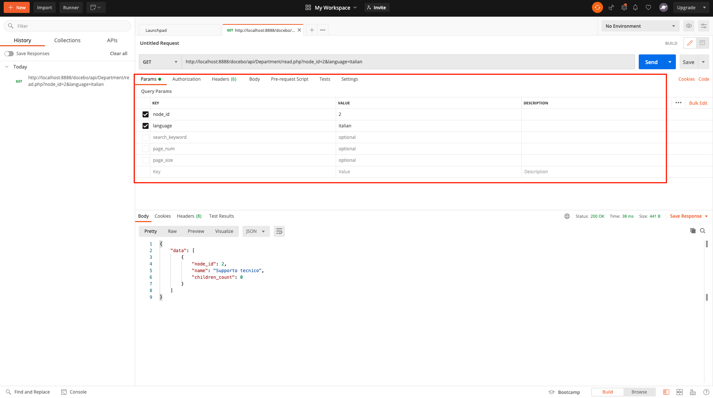

# PHP REST API - GET
This project is a simple vanilla PHP API GET. 

## Stack
* Back : PHP
* DB : MySQL (MariaDB)
* Server Environment - Apache Server (MAMP)

## Project Setup for local usage
### Configure DB
Import DB in MySQL.
```
mysql -u <your-sql-user> -p  < tables.sql;

```

Insert data in your DB && tables. </br>
Change the SQL params in file `data.sql` : </br>
* SQL_USER=\<your-sql-user>
* SQL_PASSWORD=\<your-sql-password>

```
\. data.sql
OR 
SOURCE data.sql
```

### Configure your Apache Server
MAMP - move project to /Applications/MAMP/htdocs/\<project-name> </br>
RUN server Apache.

### Configure PDO connection
Change the SQL params in file `config/Database.php` : </br>
* private $username = '\<your-sql-user>';
* private $password = '\<your-sql-password'>;


## Presentation
Simple API GET application taking the following input params && returning the organisational chart departments (nodes) of the parent department :
* node_id (INT, Mandatory)
* language (STR, Mandatory, case insensitive)
* search_keyword (STR, Optional, case insensitive)
* page_num (INT, Optional, zero-based index)
* page_size (INT, Optional, between 0 and 1000)

/!\ Language param options are "English" or "Italian". If you put any other languages, you will be prompt with the following error message : </br>
> Input "language" \<your-input>. Language parameter options are "English" or "Italian".

/!\ Pagination is implemented as follow : There is a limit of 5 results per page. If the search results in 5 or less results and the user attempts to see the next page, an error message will be displayed.


